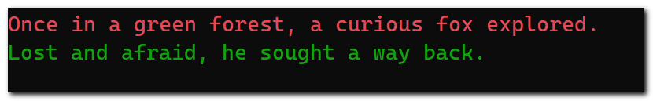
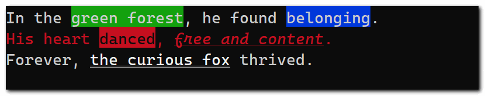

<div align="center">
    <div></div>
    <div></div>
    <p>An elegant way to color and style text in your console applications.</p>
    <h1></h1>
</div>

## Text Colors

> You will need to activate text formatter once in your application before calling any of its methods, else on
certain consoles, the text decorations not get applied.

```cs
_ = TextFormatter.Activate();

Console.WriteLine("Once in a green forest, a curious fox explored.".BrightRed());
Console.WriteLine("Lost and afraid, he sought a way back.".Green());
```



Following are the different methods supported for setting text colors along with the corresponding `ConsoleColor` enum members.

| Method Name       | `ConsoleColor` member |
| ----------------- | --------------------- |
| `Black()`         | `Black`               |
| `Red()`           | `DarkRed`             |
| `Green()`         | `DarkGreen`           |
| `Yellow()`        | `DarkYellow`          |
| `Blue()`          | `DarkBlue`            |
| `Magenta()`       | `DarkMagenta`         |
| `Cyan()`          | `DarkCyan`            |
| `White()`         | `Gray`                |
| `Gray()`          | `DarkGray`            |
| `BrightBlack()`   | `DarkGray`            |
| `BrightRed()`     | `Red`                 |
| `BrightGreen()`   | `Green`               |
| `BrightYellow()`  | `Yellow`              |
| `BrightBlue()`    | `Blue`                |
| `BrightMagenta()` | `Magenta`             |
| `BrightCyan()`    | `Cyan`                |
| `BrightWhite()`   | `White`               |

You can also apply text colors by passing one of the `ConsoleColor` enum members to the `Color()` method.

```cs
Console.WriteLine("Encountered friendly creatures who helped.".Color(ConsoleColor.DarkGray));
```


## Text Background Colors

```cs
Console.WriteLine("Time passed; fox learned about the forest.".BgBlue());
Console.WriteLine("Adventures and challenges became life.".BgBrightWhite().Black());
```


Following are the different methods supported for setting text background colors along with the corresponding `ConsoleColor` enum members.

| Method Name         | `ConsoleColor` member |
| ------------------- | --------------------- |
| `BgBlack()`         | `Black`               |
| `BgRed()`           | `DarkRed`             |
| `BgGreen()`         | `DarkGreen`           |
| `BgYellow()`        | `DarkYellow`          |
| `BgBlue()`          | `DarkBlue`            |
| `BgMagenta()`       | `DarkMagenta`         |
| `BgCyan()`          | `DarkCyan`            |
| `BgWhite()`         | `Gray`                |
| `BgGray()`          | `DarkGray`            |
| `BgBrightBlack()`   | `DarkGray`            |
| `BgBrightRed()`     | `Red`                 |
| `BgBrightGreen()`   | `Green`               |
| `BgBrightYellow()`  | `Yellow`              |
| `BgBrightBlue()`    | `Blue`                |
| `BgBrightMagenta()` | `Magenta`             |
| `BgBrightCyan()`    | `Cyan`                |
| `BgBrightWhite()`   | `White`               |

As with the text foregound colors, you can also apply text background colors by passing one of the `ConsoleColor` enum members to the `BgColor()` method.

## Support for Web Colors

You can specify either [HTML color names](https://en.wikipedia.org/wiki/Web_colors#HTML_color_names) such as `HotPink` or [hex triplets](https://en.wikipedia.org/wiki/Web_colors#Hex_triplet) such as `#3b82f6` or `#2c6`, and apply those colors to text foreground and background.

```cs
Console.WriteLine("An owl, wise and old, became his guide.".Color("HotPink"));
Console.WriteLine("Seasons changed, and fox grew wiser.".Color("#3b82f6"));
Console.WriteLine("Home now felt distant; forest was home.".BgColor("#2c6").Color("#031"));
```


## Text Styles

```cs
Console.WriteLine("With the owl's wisdom, he thrived.".Italic());
Console.WriteLine("The fox embraced nature's harmony.".Underline());
```


There are many text styles are supported as listed below.

| Method Name     | Description                                  |
| --------------- | -------------------------------------------- |
| Bold            | Increases brightness/intensity of foreground |
| Dim             | Reduces brightness/intensity of foreground   |
| Italic          | Uses italic font variant                     |
| Underline       | Adds underline to text                       |
| Blink           | Sets text to blinking                        |
| Inverse         | Swaps foreground and background              |
| Hidden          | Sets foreground same as background           |
| Strikethrough   | Crosses out text                             |
| DoubleUnderline | Adds double underline to text                |
| Overline        | Adds line over the text                      |

## Color and Style Combinations

You can chain the coloring and styling methods in any order as illustrated below to get the best results.

```cs
Console.WriteLine("In the {0}, he found {1}.", "green forest".BgGreen(), "belonging".BgBlue());
Console.WriteLine($"His heart {"danced".Inverse()}, {"free and content".Italic().Underline()}.".Red());

string who = "the curious fox".Bold().DoubleUnderline();
Console.WriteLine($"Forever, {who} thrived.".Blink());
```



## Notes

- If there is any error during initialization, the library does not print any exception message, and prints the input text without colors or styles applied for rest of the application lifetime. To see the error message, you can try passing `true` to the `TextFormatter.Activate` method. This should print exceptions, if any, that prevented the text from being decorated.
- The color and style application will be disabled if the `NO_COLOR` environment variable is set. See [https://no-color.org/]() for more information.
- For the non-string values, you will need to convert them to strings first before calling one of the coloring or styling methods on them. For example, `$"I have {42.ToString().Red()} apples."`. I found enabling all of the coloring methods on the `object` type to be very intrusive as it floods the IntelliSense suggestions with dozens of coloring and styling methods for each and every variable.
- The strings returned by `TextFormatter` methods should be used solely for printing to console. Writing these string to log files for example, may lead to illegible text, and corruption of file content structure.
- Support for Linux consoles is not yet tested.
